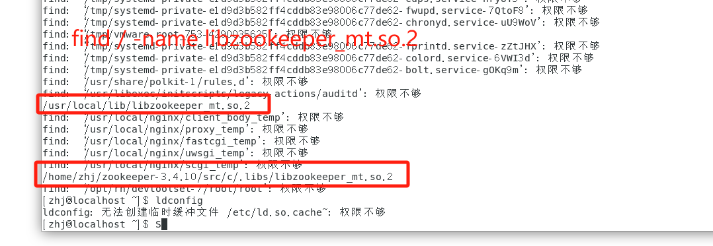
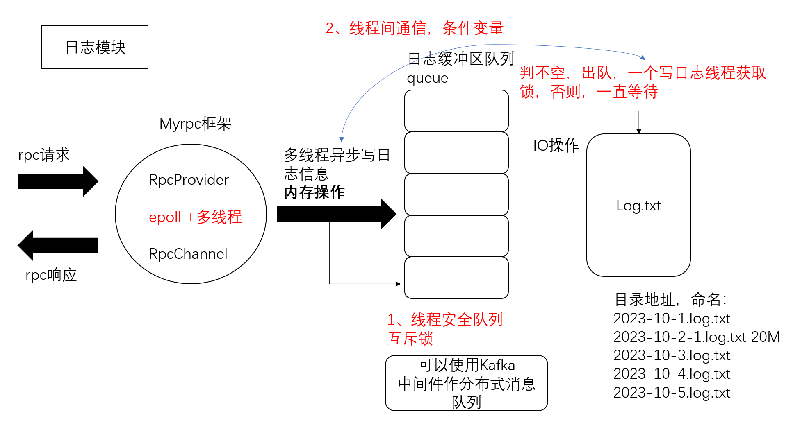

## v2.6.0
- 开发RpcProvider的网络服务

## v3.0.0 
- 实现RpcProvider发布服务方法, 完成RpcProvider::NotifyService代码编写

## v3.0.1
 - RpcProvider分发rpc服务, RpcProvider::onMessage

## v3.5.0
 - rpc响应回调实现, RpcProvider::SendRpcResponse

## v3.6.0
- 新建caller,实现RpcChannel的调用过程, Rpc方法的调用过程

## v4.0.0
- 添加应用示例,包括添加register方法,以及添加新的服务friendservice

## v4.5.0
- 实现RpcController控制模块的抽象类,输出错误信息

## v5.0.0
- 日志系统设计, 以及日志缓冲队列, 下一步进行集成src中

## v5.1.0
- 日志模块集成到rpcprovider

## v5.2.0
- 把日志模块集成到rpcprovider,可以继续扩展

## v6.0.0
- 封装zookeeper的客户端类zookeeperutil.cc

## v6.5.0
- 项目集成zookeeper, 在服务提供方rpcprovider.cc和调用方mprpcchannel.cc分别配置
## v6.6.0 
- 2023.11.25修改日志模块

## 调试
- [zhj@localhost bin]$ ./provider  -i test.conf 
- [zhj@localhost bin]$ ./consumer -i test.conf
- gdb
- 

### bug
- (1). request parse error! content:
- (2). std::string response_str(recv_buf, 0, recv_size); //bug出现问题, recv_buf中遇到\0后面的数据就存不下来, 导致反序列化失败 
- (3). [zhj@localhost bin]$ ./zookertest 
./zookertest: error while loading shared libraries: libzookeeper_mt.so.2: cannot open shared object file: No such file or directory 
- (4). 执行 ./provider -i test.conf 编译引用了第三方库zookeeper_mt.so的代码后，执行出现了以下错误
[zhj@localhost bin]$ ./provider: error while loading shared libraries: libzookeeper_mt.so.2: cannot open shared object file: No such file or directory
- 错误解决:
  
共享库文件安装到了/usr/local/lib(很多开源的共享库都会安装到该目录下)或其它"非/lib或/usr/lib"目录下，在执行ldconfig命令前，需要把新共享库目录加入到共享库配置文件/etc/ld.so.conf中，如下:
- echo "/usr/local/lib" >> /etc/ld.so.conf
- ldconfig 
- ldconfig命令的用途，主要是在默认搜寻目录(/lib和/usr/lib)以及动态库配置文件/etc/ld.so.conf内所列的目录下，搜索出可共享的动态链接库(格式如lib*.so*)，然后创建出动态装入程序(ld.so)所需的连接和缓存文件，缓存文件默认为/etc/ld.so.cache，此文件保存已排好序的动态链接库名字列表。

## 日志模块

## 编译
- protoc user.proto --cpp_out=./

