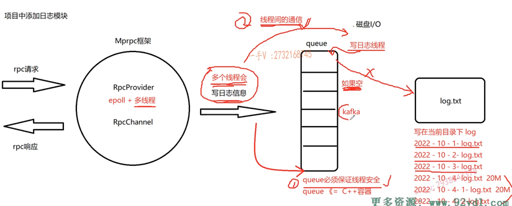

## v2.6.0
- 开发RpcProvider的网络服务

## v3.0.0 
- 实现RpcProvider发布服务方法, 完成RpcProvider::NotifyService代码编写

## v3.0.1
 - RpcProvider分发rpc服务, RpcProvider::onMessage

## v3.5.0
 - rpc响应回调实现, RpcProvider::SendRpcResponse

## v3.6.0
- 新建caller,实现RpcChannel的调用过程, Rpc方法的调用过程

## v4.0.0
- 添加应用示例,包括添加register方法,以及添加新的服务friendservice

## v4.5.0
- 实现RpcController控制模块的抽象类,输出错误信息

## v5.0.0
- 日志系统设计, 以及日志缓冲队列, 下一步进行集成src中

## v5.1.0
- 日志模块集成到rpcprovider

## v5.2.0
- 把日志模块集成到rpcprovider,可以继续扩展

## v6.0.0
- 封装zookeeper的客户端类zookeeperutil.cc

## 调试
- [zhj@localhost bin]$ ./provider  -i test.conf 
- [zhj@localhost bin]$ ./consumer -i test.conf

### bug
- 1. request parse error! content:
- 2.std::string response_str(recv_buf, 0, recv_size); //bug出现问题, recv_buf中遇到\0后面的数据就存不下来, 导致反序列化失败 
- 3.[zhj@localhost bin]$ ./zookertest 
./zookertest: error while loading shared libraries: libzookeeper_mt.so.2: cannot open shared object file: No such file or directory 

## 日志模块

## 编译
- protoc user.proto --cpp_out=./

